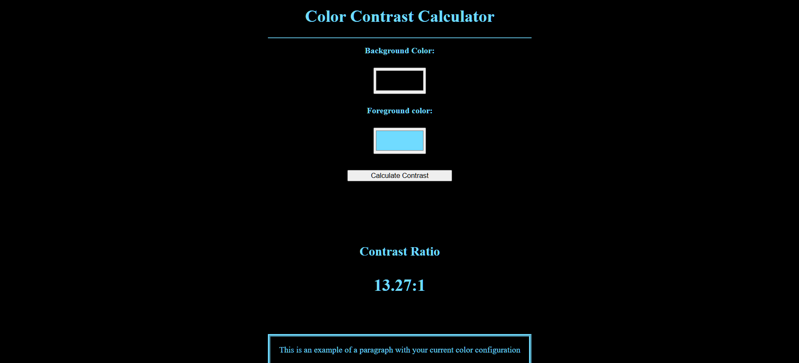

# Color Contrast Calculator

A clean, interactive web application that calculates the contrast ratio between two colors based on the [WCAG (Web Content Accessibility Guidelines)](https://www.w3.org/WAI/standards-guidelines/wcag/) formula. This helps designers and developers ensure their color choices are accessible to users with visual impairments.

**Live Demo: [View the Calculator]([https://yourusername.github.io/color-contrast-calculator/](https://ozias-tumimana.github.io/color-contrast-calculator/))**

 

## Features

- **Real-time Calculation:** Input colors using native color pickers and see the ratio update instantly.
- **WCAG Compliance Feedback:** The calculated ratio is displayed clearly.
- **Live Preview:** The page's background and text colors change to provide a visual example of the chosen color combination.
- **Built with Vanilla JS:** Implements the precise WCAG luminosity contrast algorithm without external libraries.

## How It Works

The tool uses the WCAG 2.1 formula for calculating contrast:
1.  Converts hex codes from the color inputs into sRGB values.
2.  Calculates the relative luminance of each color.
3.  Computes the contrast ratio using the formula: `(L1 + 0.05) / (L2 + 0.05)` where `L1` is the luminance of the lighter color and `L2` is the luminance of the darker color.

## Technologies Used

- **HTML5:** For structure and the native color `<input>` type.
- **CSS3:** For styling and layout.
- **Vanilla JavaScript:** For implementing the contrast algorithm and DOM manipulation.

## How to Run Locally

1.  Clone this repository:
    ```bash
    git clone https://github.com/yourusername/color-contrast-calculator.git
    ```
2.  Navigate to the project directory:
    ```bash
    cd color-contrast-calculator
    ```
3.  Open the `index.html` file in your web browser.

## Future Enhancements

- Explicitly display pass/fail status for WCAG AA and AAA compliance levels for normal and large text.
- Allow users to input color hex codes manually via text input.
- Provide a history of recently calculated color pairs.
